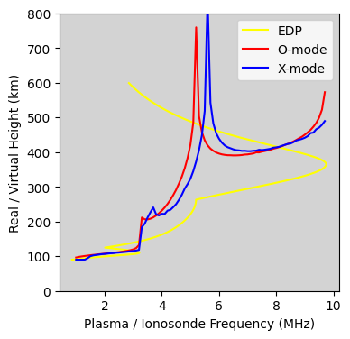
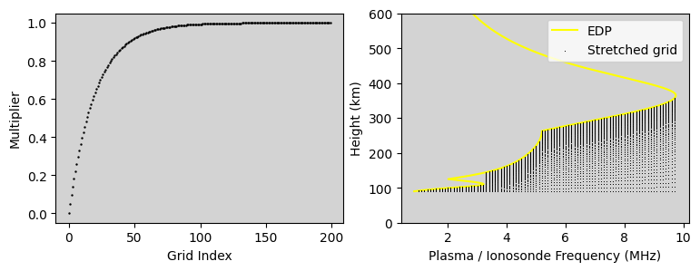
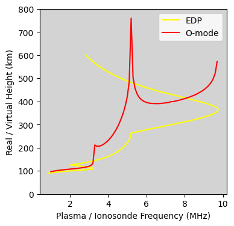

# PyRayHF (Python HF Ray Tracer for the Ionosphere)
[](https://pypi.org/project/PyRayHF/)
[](https://github.com/victoriyaforsythe/PyRayHF/actions/workflows/main.yml)
[](https://PyRayHF.readthedocs.io/en/latest/?badge=latest)
[](https://doi.org/10.5281/zenodo.15555327)
[](https://coveralls.io/github/victoriyaforsythe/PyRayHF?branch=main)

PyRayHF is a Python-based software package for analytic HF raytracing through the ionosphere.

For a given electron density profile and the magnetic field it calculates virtual heights for the upward-propagating HF rays in ordinary (O) and extraodinary (X) modes.

A key advantage of PyRayHF is its efficiency: it calculater the virtual heigh simultaneousely for all given ionosonde freqeuncies.


# Installation

PyRayHF can be installed from PyPI, which will handle all dependencies:

```
pip install PyRayHF
```

Alternatively, you can clone and install it from GitHub:

```
git clone https://github.com/victoriyaforsythe/PyRayHF.git
cd PyRayHF
python -m build .
pip install .
```

See the documentation for details about the required dependencies.

# Example Workflow

1. Provide input arrays for one vertical ionospheric profile, where $den$, $bmag$, $bpsi$, and $alt$ are the arrays of the same length, referring to electron density in m$^{-3}$, strength of the magnetic field in Tesla, angle of the magnetic field to the vertical in degrees, altitude in km.
Provide the array of frequencies $freq$ at which you would like to sample this profile, that will be the frequencies of the HF sounder.

Below are the input arrays generated by PyIRI in Example_Generate_Input_Arrays.


2. Compute virtual height for the ordinary 'O' propagation mode. A low number
of vertical grid points is sufficient for O-mode (e.g., 200).

```
mode = 'O'
n_points = 200
vh_O = PyRayHF.library.virtical_forward_operator(input_arrays['freq'],
                                            input_arrays['den'],
                                            input_arrays['bmag'],
                                            input_arrays['bpsi'],
                                            input_arrays['alt'],
                                            mode,
                                            n_points)
```

3. Compute virtual height for the extraordinary 'X' propagation mode.
A high number of vertical grid points is recommended for X-mode (e.g., 20000),
since the result may be noisy at low resolution.

```
mode = 'X'
n_points = 20000
vh_X = PyRayHF.library.virtical_forward_operator(input_arrays['freq'],
                                            input_arrays['den'],
                                            input_arrays['bmag'],
                                            input_arrays['bpsi'],
                                            input_arrays['alt'],
                                            mode,
                                            n_points)
```



# Virtual Height Calculation Overview

The virtual height is the apparent reflection height of a radio wave in the ionosphere, assuming the wave travels at the speed of light in a vacuum.
In reality, the wave slows down due to the ionospheric plasma, and this effect is captured using the group refractive index.

To compute the virtual height, we integrate the group refractive index over the real height profile.
This process uses several physical quantities, all of which can be derived from models or measurements:

- **Electron Density**: Used to compute the plasma frequency. This quantity is the primary factor affecting wave propagation.
- **Magnetic Field Strength**: Needed to calculate the gyrofrequency, which affects how the wave interacts with the ionized medium.
- **Magnetic Field Angle**: The angle between the wave vector and the magnetic field line influences wave polarization and refraction.

Using these parameters, we compute:

- **X**: The ratio of plasma frequency squared to wave frequency squared. This determines how strongly the plasma affects wave propagation.
- **Y**: The ratio of gyrofrequency to wave frequency. This captures the influence of the magnetic field.
- **Refractive Index (mu)**: Describes how much the wave is slowed down by the medium.
- **Group Refractive Index (mu_prime)**: Represents how the wave packet travels, and is derived from the refractive index.

Once the group refractive index profile is known, it is integrated over the height range of interest to obtain the virtual height.
This value corresponds to the height at which the wave would appear to reflect if it were traveling through a vacuum.

# Why a Stretched Grid is Needed

In standard numerical modeling, it is common to use a uniform vertical grid, where points are evenly spaced in altitude.
However, when calculating the virtual height in the ionosphere, this approach can lead to poor resolution near the reflection height.

The reflection height is the point where the radio wave slows down dramatically and turns back due to the changing refractive index.
Around this region, the group refractive index varies rapidly with altitude, and most of the contribution to the virtual height integral comes from this narrow layer.

A uniform grid may not have enough points in this critical region, resulting in large numerical errors and an inaccurate estimate of the virtual height.
This is especially problematic when the wave frequency is close to the local plasma frequency, where the integrand becomes sharply peaked.

To solve this, we use a **stretched vertical grid**. This grid places more points near the reflection region and fewer points in regions where the variation is smooth.
By concentrating resolution where it is most needed, the stretched grid ensures accurate integration of the group refractive index, while keeping the total number of points manageable.
This approach improves both efficiency and precision, making it ideal for ionospheric ray tracing and virtual height modeling.

# Grid Construction for Virtual Height Calculation

For each ionosonde frequency, we interpolate the **electron density profile (EDP)**—converted into **plasma frequency**—to determine the height at which the ionosonde frequency equals the local plasma frequency.
This height is referred to as the **reflection height**, and it marks the upper boundary for the integration in virtual height calculation.

Once the reflection height is known, we construct a new vertical grid tailored to that specific frequency.
This is achieved using a **stretched grid function** that varies smoothly from 0 to 1.
The function concentrates points near the top of the grid—close to the reflection height—where resolution is most critical.

We apply this function by multiplying it by the altitude range of interest: from the **minimum altitude** (e.g., 80 km) to the **reflection height**.
This results in a **resampled array of altitudes**, with a fixed number of points, `N_points`.

The figures below show the multiplier obtained from the **stretched grid function** and the locations of the new stretched grid relative to the reflection height for each ionosonde frequency, plotted on the same x-axis as the plasma frequency.
This new grid ensures fine resolution near the reflection height while minimizing unnecessary points at lower altitudes.



By repeating this process for each ionosonde frequency, we form a 2D matrix of altitudes with dimensions `[N_frequency, N_points]`.
At this stage, we **interpolate all input parameters**—such as electron density, magnetic field strength, and angle—onto this new grid.
This ensures that every virtual height calculation uses accurately aligned input data, matched to the specific resolution needs of the ray's path at that frequency.

The following figures present the input data converted into 2D arrays, where the x-axis represents the ionosonde frequency and the y-axis corresponds to the vertical grid index, with a size of `N_points`.
The first figure displays the altitude of each grid point. The subsequent figures show the interpolated plasma density, magnetic field strength, and magnetic field angle.


The following figures present the computed **X**, **Y**, **Refractive Index (mu)**, and **Group Refractive Index (mu_prime)** parameters for O-mode.


The group refractive index **Group Refractive Index (mu_prime)** is multiplied with a matrix that contains the distances between the grid points and summed over the second axis, obtaining the virtual height, shown with red curves on the figure below.



See the [tutorials](https://github.com/victoriyaforsythe/PyRayHF/tree/main/docs/tutorials) folder for mode detailed examples.
